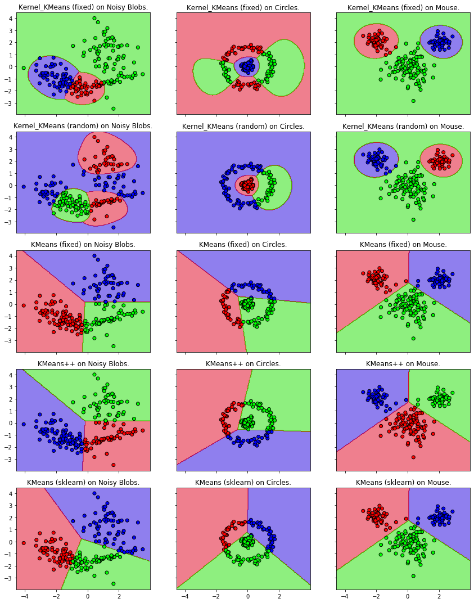

# Gradient Descent Implementation
The exercise explores Gradient Descent implementation on Himmelblau function and explores the Newton Method for finding local optima. 

# K-Means Implementation
Explores the K-Means algorithm.

